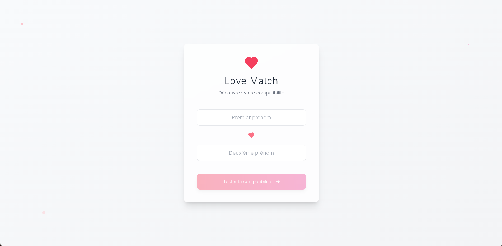

# 💘 Love Match - React + TypeScript
Une petite application fun et romantique pour tester la **compatibilité amoureuse entre deux prénoms (psychopathes que nous sommes)** 💑.  
Construite avec **React + TypeScript**, cette app est idéale pour apprendre à manipuler les formulaires, les états, les composants et le typage.

## Aperçu
L'utilisateur entre deux prénoms, clique sur un bouton, et l'application lui affiche un **taux de compatibilité aléatoire**, accompagné d’un petit message hehe. Voici un exemple de UI:



## Fonctionnalités
- 🎯 Test de compatibilité entre deux prénoms
- 🔢 Score de 0 à 100%, généré de façon aléatoire (pour le moment, don't worry)
- 💬 Message personnalisé selon le score
- ♻️ Possibilité de relancer un test
- 🧠 Composants typés avec TypeScript

## Stack technique
- [React](https://reactjs.org/) (avec [Vite](https://vitejs.dev/))
- [TypeScript](https://www.typescriptlang.org/)
- [Tailwind CSS](https://tailwindcss.com/)

## Installation
```bash
git clone https://github.com/ton-utilisateur/love-match-react.git
cd love-match-react
npm install
npm run dev